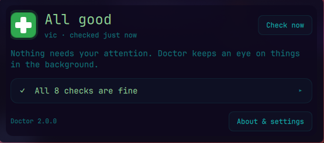
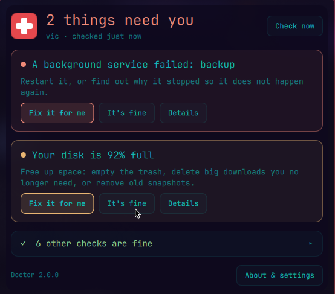

# Omarchy Doctor


**Is my computer OK?** Omarchy Doctor puts a medical cross on your bar that answers that at a glance:

- **Green**: nothing you need to do.
- **Yellow**: something is worth a look.
- **Red**: fix it soon.

The number on the cross is how many things need you. Click it and Doctor tells you what's wrong in plain words, with one button to get it fixed.



## Install

```bash
omarchy plugin add https://github.com/nixfred/omarchy-doctor.git --enable
```

Run that as yourself in a terminal (no `sudo`). The cross appears on your bar, and Doctor runs its first check about 30 seconds later. Update later with `omarchy plugin update nixfred.doctor`.

## What it checks

Eight things that you can actually do something about:

| Check | Warns when |
|---|---|
| Disk space | your disk is 90% full (red at 95%) |
| Background services | a service has failed |
| Drive health | a drive's SMART self-test says it is failing |
| Temperature | a sensor passes its own hardware limit |
| Battery | it holds less than 60% of its original charge |
| Internet | you're offline, or websites can't be found (DNS) |
| Wi-Fi | Wi-Fi is off and you have no cable plugged in |
| Memory | your computer is actually short on memory |

Doctor checks every 15 minutes in the background (you can turn that off). If a check can't run, for example when `smartmontools` isn't installed, Doctor says so in the list and **doesn't count it against you**.

## When something needs you



*(Example problems shown for illustration.)*

Each problem has three buttons:

- **Fix it for me** hands the problem to your coding agent, the one you picked with `omarchy default agent`. It gets everything Doctor knows and is told to ask before anything risky. When it finishes it asks Doctor to check again. The fix only counts once Doctor sees the problem is gone, and then it shows under *Recently fixed*.
- **It's fine** means you know about it and you're OK with it (say, a disk that's 91% full on purpose). It stops counting toward the icon until it gets **worse**, and then it comes back.
- **Details** shows what Doctor saw and the command to look at it yourself.

## Settings

Click **About & settings** in the panel, or right-click the cross.


## Privacy

Everything stays on your computer. The checks only read. Nothing changes unless you press **Fix it for me**, and then your own agent makes the changes, with its own permission settings. Doctor's history lives in `~/.local/state/omarchy-doctor/`.

## For tinkerers

```bash
python3 doctor.py scan                  # run all eight checks (JSON lines)
python3 doctor.py recheck storage       # check one thing again
omarchy-shell nixfred.doctor status     # what the panel shows
```

From a source checkout, `python3 install.py --enable` installs with a backup of any earlier version. Tests: `python3 -m unittest discover -s tests`.

License: MIT · Made by Fred Nix · [nixfred.com](https://nixfred.com)
