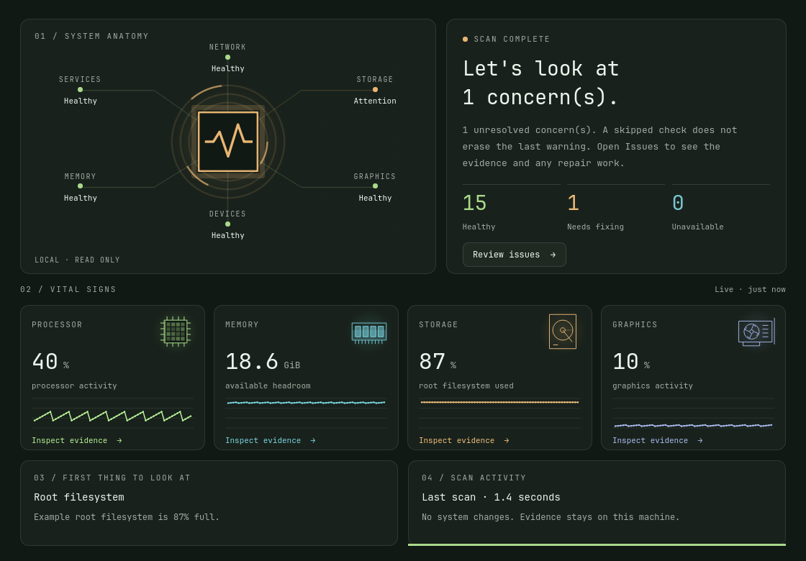
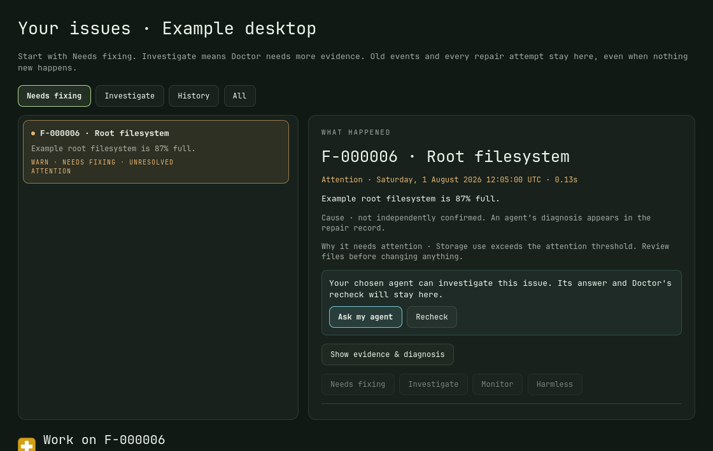
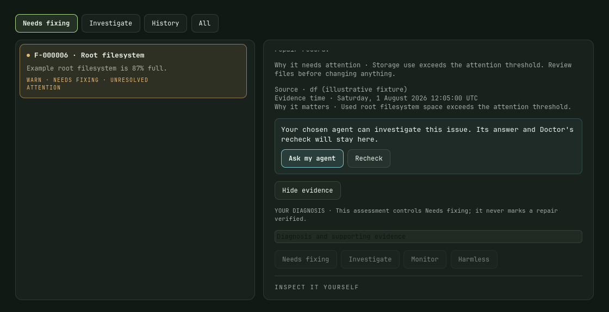
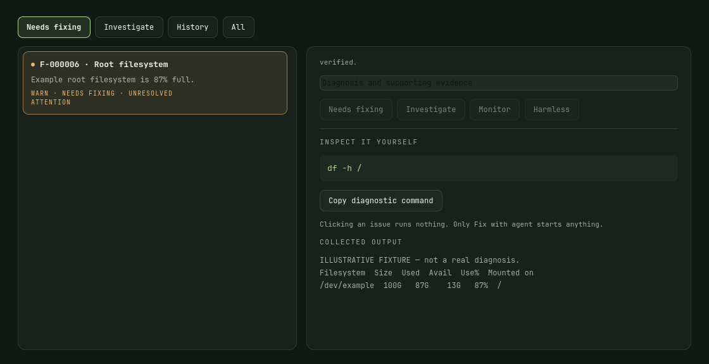
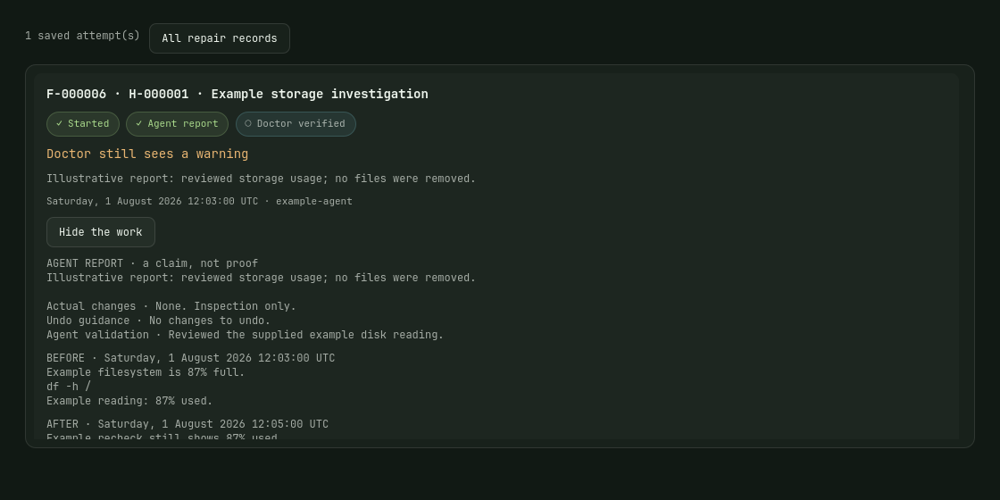
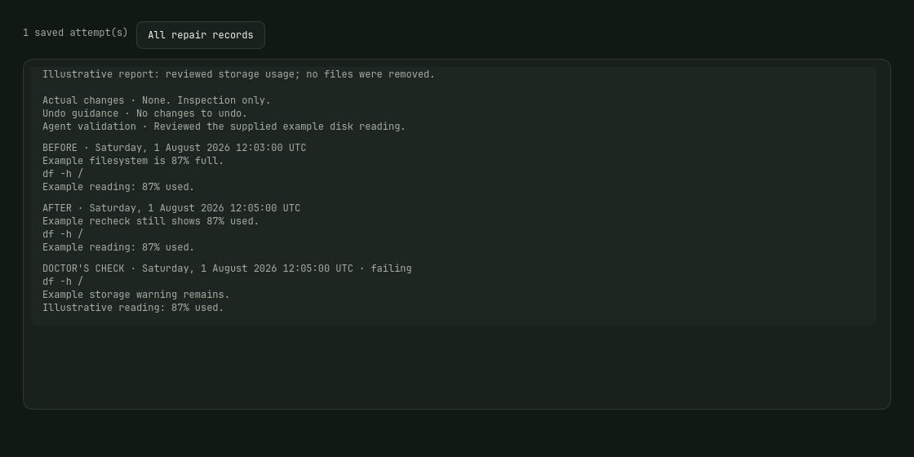
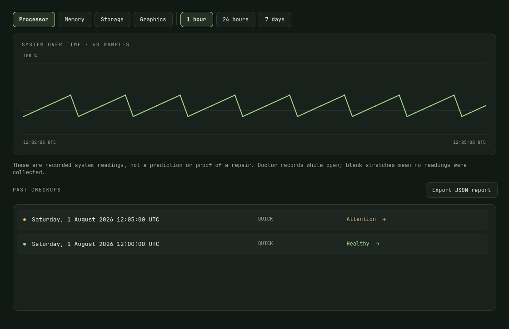
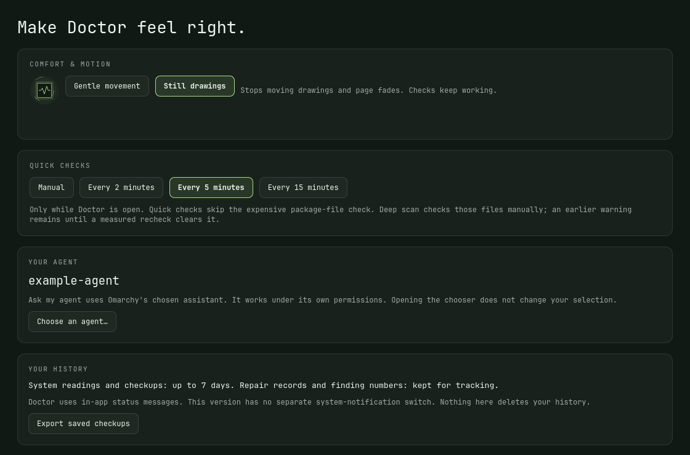
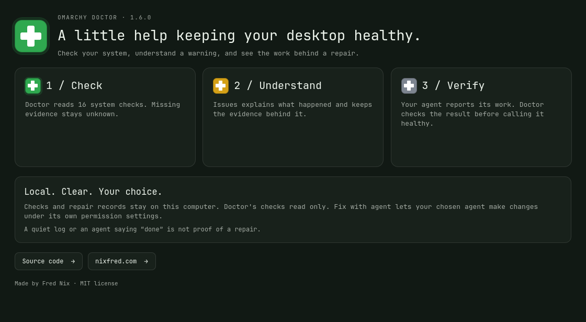

# Omarchy Doctor


**A clearer picture of your Omarchy desktop.** Doctor checks your system, explains warnings, and keeps the evidence behind an agent's repair. Open it from your bar whenever something feels wrong—or just to see how your machine is doing.

Doctor's own checks read the system; they do not repair it. **Ask my agent** hands a selected issue to your chosen Omarchy assistant, which works under its own permissions. Its report and Doctor's independent recheck appear together.

The screenshots below are native Doctor 1.6.0 panes rendered with invented example data. They illustrate the interface, not anyone's real computer or a promised result. Colors follow your Omarchy theme.

## Install and open

You need Omarchy Quattro with Quickshell, Python 3, Git and the Omarchy plugin CLI. In a terminal, as your normal desktop user:

```bash
omarchy plugin add https://github.com/nixfred/omarchy-doctor.git --enable
```

Follow Omarchy's installation prompts. Click the medical cross in your bar, or open Doctor with:

```bash
omarchy-shell nixfred.doctor open
```

To get updates:

```bash
omarchy plugin update nixfred.doctor
```

Already keeping a source checkout? See the [source installation guide](docs/development.md#install-from-source). Use one installation approach consistently; neither needs `sudo`.

## Your first checkup

Click **Run Doctor** for a quick scan. Start with **Overview**: it shows the system diagram, hardware readings and concerns worth reviewing. Click **Review issues** to continue. A fresh installation builds its history as you use it.



Quick scans cover services, logs, processor, memory, temperature, storage, drive health, graphics, battery, networking, audio, Bluetooth, Wi-Fi, crashes and shell warnings. **Deep scan** also inspects package-owned files; it can take longer. A quick scan skipping that work retains the latest warning or unavailable result until a measured recheck replaces it. **Cancel** leaves unfinished coverage visible.

| Result | What to do |
| --- | --- |
| Healthy / green | Completed, fresh checks found no unresolved concern. |
| Attention / amber or Problem / red | Open Issues and read what triggered the result. |
| Unavailable or incomplete | Doctor needs more evidence; a missing tool or permission can be the reason. |
| Old result | Run a new scan. Results over ten minutes old cannot establish current health. |

The bar's number counts active actionable concerns and current unavailable checks. Past crash and log records have their own history count; rereading them does not create new repair work. A green result describes measured checks, not a guarantee about every part of the computer.

## Understand an issue

**Issues** separates Findings, Repair records and Checkup history into focused views. The panel fits the available screen work area, and long evidence uses visible Previous/Next pages at normal text size. Identity and checkup lists also have page controls; wheel scrolling is disabled. Start with **Needs fixing**, the default filter. **Investigate** shows current uncertainty, **History** shows past events, and **All** keeps every check available. Old events can still need fixing when their cause has been diagnosed.



Choose a finding, then open **Show evidence & diagnosis**. You can inspect its time, source, output and diagnostic command. Copying the command does not run it. Finding numbers such as `F-000001` stay stable on this computer, so you can follow the same issue across checkups.



Crash and journal entries are grouped by a specific signature. **Historical** means the same old evidence was seen again; **New** means a new event appeared; **Recurring** means a new event matches an earlier signature. Those labels describe timing, not a confirmed cause. Known harmless journal notices remain in the evidence with an explanation.

Scroll within the evidence card to see the inspection command and collected output.



## Ask your agent—and check the result

Click **Ask my agent** to send the selected finding, its evidence and investigation instructions to your default Omarchy agent. Doctor asks it to inspect first, report actual changes and validation, and ask before destructive work. Your agent's own permission settings enforce what it may do.

The repair record tracks the attempt and the returned report. **Show the work** reveals changes, supplied undo guidance, and Doctor's measured before/after evidence.



Scroll through the expanded record to see the measured checks.



An agent saying “done” does not mark a repair verified. A state check must measure healthy again. Crashes and log events stay repair-unproven: a quiet log cannot prove their cause was fixed. If the agent returns no usable report, Doctor shows that honestly. A later failure reopens the concern while preserving earlier verification records. **Recheck** runs the selected diagnostic again.

## See what changed over time

In Issues, click **Show history**. Choose Processor, Memory, Storage or Graphics and a 1-hour, 24-hour or 7-day range. Select a saved checkup to inspect what Doctor saw at that time; use **Back to current scan** to return.



Graphs use recorded observations. Blank stretches mean no readings were collected; Doctor does not invent values across long gaps. Live sampling and automatic scans run while its panel is open. A scan already underway may finish after you close it.

## Make it comfortable

**Settings** lets you choose gentle movement or still drawings, and manual checks or quick checks every 2, 5 or 15 minutes. Your current selection stays in place until you change it. **Choose an agent…** opens Omarchy's existing chooser.



Left-click the bar icon to open or close Doctor; middle-click to scan; right-click for Settings. Inside the panel, `R` scans and `Esc` closes it. In Issues, `C` copies the selected command; arrows move through the focused list and Tab moves between controls.

**About** gives a short explanation and links to the project and its author.



## Common questions

**Why is a hardware check unavailable?** Some sensors and tools are optional. `lm_sensors` improves temperature coverage; `smartmontools` adds drive-health checks. Unsupported hardware and denied permissions remain unknown. SMART checks never open a password prompt. Install optional tools only if you need that coverage.

**Why does package integrity still warn?** Deep scan uses package-tool output. Doctor counts a path as missing only when the check reports actual absence. Access-denied or other unreadable paths are incomplete coverage: they appear in Investigate, with their evidence retained. A prior agent report cannot establish current healthy coverage. Read the evidence with your agent before changing packages or permissions.

**Where is my data?** Observations and checkups stay locally in `~/.local/state/omarchy-doctor/` (or `$XDG_STATE_HOME/omarchy-doctor`). Readings/checkups retain up to seven days, with at most 1,000 checkups. Finding numbers and repair records persist for tracking. Each computer keeps its own state.

**Can I share a report?** **Export JSON report** saves a local file. Review it first: diagnostics can contain device names, service names and log messages. Doctor does not upload them itself. Handing evidence to a cloud-backed agent is subject to that agent's data handling. Exported files remain until you remove them.

**How do I remove it from the bar?** Run `omarchy plugin disable nixfred.doctor`. Source-install backup and recovery details are in the [development guide](docs/development.md#backups-and-recovery).

For command-line use, agent completion details and tests, see [Development and verification](docs/development.md).

Made by [Fred Nix](https://nixfred.com) · [Source on GitHub](https://github.com/nixfred/omarchy-doctor) · [MIT license](LICENSE).

Agent handoffs now open a prominent working view with the finding, confirmed agent, elapsed time, real events, receipts and independent verification. Supported Codex runs stay in the background; other agents keep an accessible visible session. The icon opens the current concern directly: green means fresh supported health, yellow a current warning, red a major current problem, and gray names incomplete or old evidence. Historical events remain in history. Valid measured recovery clears a passing concern without erasing its evidence or crediting an agent; thermal recovery requires two degrees of headroom below every sensor warning point.

Past-event labels distinguish an unreviewed event from a current finding that still needs action. Unknown checks remain visibly incomplete. A handoff or agent report does not verify repair, and recovery without a Doctor handoff is labeled as a measured recovery.

Background Codex requires exact existing trusted-directory configuration and successful real Git repository discovery. A non-repository or home-wide repository context uses the existing visible interactive launcher. Doctor does not add a repository-check bypass, change trust, or weaken the existing approval policy. Saved launch failures identify the finding and retain their log; changing the planner does not retry a failed attempt.

Journal collection decodes journald MESSAGE binary arrays as UTF-8, strips ANSI controls, retains normalized warning evidence, and marks malformed/lossy/untimed data as incomplete coverage. Log warnings, explicit QA records and historical/recovered events stay readable in Log notes/history; recurrence alone is not repair proof. Existing cursor identities and historical records survive normalization, with prior aliases retained.

The bar's numbered badge counts fresh actionable faults only. Coverage and unproven event review use neutral gray with separate counts in the panel. Green means no known actionable problems in the fresh checked scope, not that skipped or unsupported checks passed. Ordinary informational/coverage records do not solicit an agent repair, and old failed handoffs stay in repair history. A supported manual assessment can still flag a log warning as actionable. No blanket pi.audio or warning suppression is used.


### Finish verification

Click a gray Doctor icon to open the verification checklist. The shell action reads the same available current-boot/seven-day user-journal scope through a fixed end time in oldest-first cursor pages. Each operation reads at most 20 pages / 15 seconds; Continue resumes its committed cursor, cancellation retains progress, and EOF is required. Large pages shrink to preserve the per-page output bound. Cursor loss, access limits and invalid/lossy records stay incomplete; restart is explicit and old evidence remains. Once complete, ordinary checks read incremental tails (at most 50 pages / 8 seconds), preserving the verified baseline; any remaining backlog stays gray. This verifies collection, not a repair or the absence of UI warnings.

Verify protected package files first shows the exact read-only command `sudo /usr/bin/pacman -Qk`. Opening its normal Omarchy terminal is user-triggered; authenticate there and use Ctrl+C to cancel. Only pacman is elevated. Doctor and its history are never run as root; packages, permissions, agents and shell configuration are unchanged. A successful complete measurement keeps its original timestamp and is reused only within ten minutes with unchanged package database metadata. It is not silently renewed; expiry or a changed inventory requires a fresh user-triggered verification. Actual missing files stay actionable, while denial, cancellation, failed launch and incomplete output remain unverified.

The boot-journal gap also has Read complete boot journal: the same available current-boot/seven-day priority 0–3 query, all field contents, cursor continuation and confirmed EOF. It preserves the existing narrow benign-note and crash-duplicate policy; invalid records still block completion. This handles invalid-field coverage gaps without weakening the healthy definition or silently broadening privileges.
